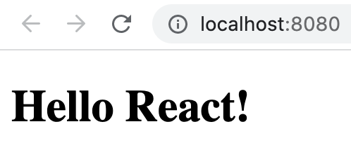

# Styled Components

Once we complete task 1, we have a very basic React component without any style.



We are going to apply some styles using [Styled Components](https://styled-components.com/).

## Task 1: Setup & Use Styled Components

Install `styled-components`. Using styled-components, apply **red** color to header by creating a `<Header/>` element. Here is how it looks like:


First we need to install `styled-components` package. Import it in our `index.js` using:

```javascript
import styled from "styled-components";
```

Then `<Header/>` can be created like:

```javascript
const Header = styled.h1`
  color: red;
`;
```

## Task 2: Media Queries

Right now, the header size is same for both desktops and mobile devices. We need a smaller size of **24px** for Header in mobile devices with width upto **480px**. Also, change the color to green just for us to understand that the mobile style is applied. Implement that using media query.


Updated `<Header />` element:

```javascript
const Header = styled.h1`
  color: red;

  @media (max-width: 480px) {
    font-size: 24px;
    color: green;
  }
`;
```

## Task 3: Extending Components

We are going to create a Hero element. Hero element refers to a block with very large text. Since a Hero element is also created using `h1` tag, we can extend our `Header` element to create `Hero` element. After extending, apply **blue** color and a font size of **100px**.

Add the `<Hero>` element to component before `<Header>` to see how it works. This is how the current component looks like:

```html
<div>
  <Hero>I am a hero</Hero>
  <header>Hello React!</header>
</div>
```


Hero element:

```javascript
const Hero = styled(Header)`
  color: blue;
  font-size: 100px;
`;
```
