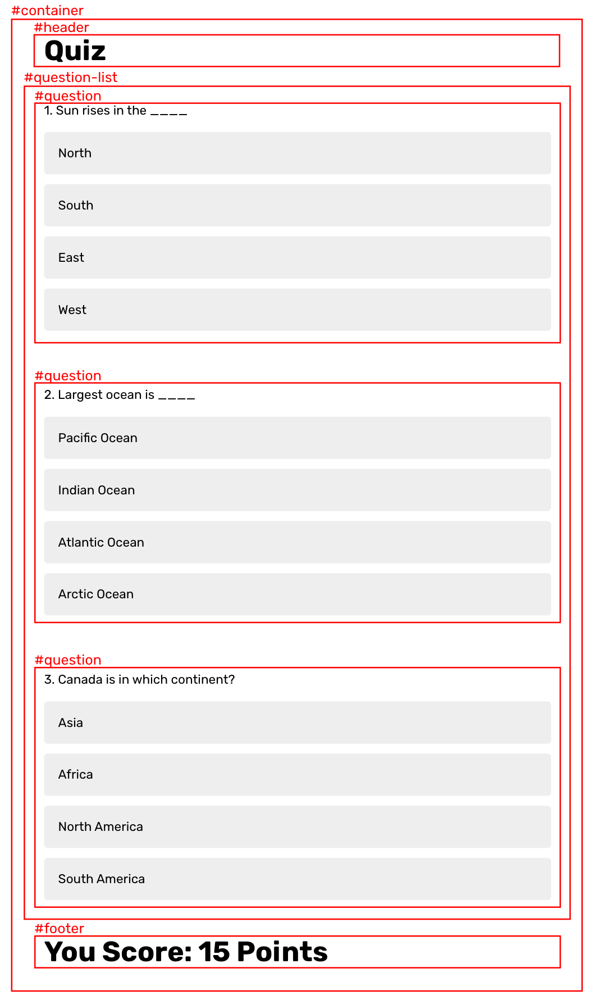

# Designing Quiz App

After completing first two tasks, you now know how to create React components and style it using Styled Components. Using your knowledge, you need to design a simple quiz application.

## Structuring React App

First step before creating components, is to look at the design and identify the components. Here is one approach you can use.

Try to complete the task yourself with your existing knowledge. You need to focus only the styling part. You do not have to worry about the functionality.

## Running the application

When you finally run the application, it should show the above quiz design on the page. That's it.

After completing this task, you can compare your solution with my solution. You might get better ideas on structuring React components and style files. Good luck!
